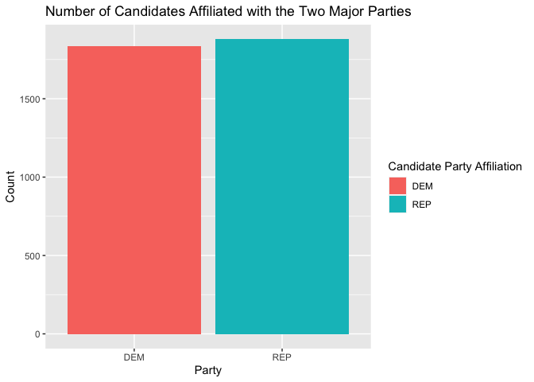

<!-- README.md is generated from README.Rmd. Please edit that file -->

# fec20 

<!-- badges: start -->

[](https://www.tidyverse.org/lifecycle/#experimental)
[](https://CRAN.R-project.org/package=fec20)
[](https://github.com/baumer-lab/fec20/actions/workflows/R-CMD-check.yml)
<!-- badges: end -->

**fec20** contains data from the [Federal Election Commission
(FEC)](https://www.fec.gov/) website pertaining to candidates,
committees, results (forthcoming), contributions from committees and
individuals, and other financial [data for the United States 2019-2020
election cycle](https://www.fec.gov/data/browse-data/?tab=bulk-data).
Additionally, for the datasets that are included as samples, the package
includes functions that import the full versions.

This package is a natural successor of the `fec16` R package (that
contains data from the 2015-2016 elections). `fec16` is available on
CRAN.

## Installation

Install the development version from GitHub:

``` r
# If you haven't installed the remotes package yet, do so:
# install.packages("remotes")
remotes::install_github("baumer-lab/fec20")
```

``` r
# Load package
library(fec20)
```

## Datasets Included

### Full Datasets

-   `candidates`: candidates registered with the FEC during the
    2019-2020 election cycle
-   `committees`: committees registered with the FEC during the
    2019-2020 election cycle
-   `campaigns`: the House/Senate current campaigns
-   `pac`: Political Action Committee (PAC) and party summary financial
    information
-   `states`: geographical information about the 50 states

### Sample Datasets (with 1000 random rows each)

-   `individuals`: individual contributions to candidates/committees
    during the 2020 election cycle
-   `contributions`: candidates and their contributions from committees
    during the 2020 election cycle
-   `expenditures`: the operating expenditures
-   `transactions`: transactions between committees

### Forthcoming Datasets

There are 3 forthcoming datasets that contain results from the House,
Senate, and Presidential elections.

## Functions Included

The following functions retrieve the entire datasets for the sampled
ones listed above. The size of the raw file that is downloaded by
calling each function is given for reference. All functions have an
argument `n_max` which defaults to the entire dataset but the user can
specify the max length of the dataset to be loaded via this argument.

-   `read_all_individuals()` \~ 4.37GB
-   `read_all_contributions()` \~ 14.2MB
-   `read_all_expenditures()` \~ 52.1MB
-   `read_all_transactions()` \~ 118.9MB

## How is the data relational?

The headers of each table show the dataset name. The underlined
variables are **primary keys** while all the others are **foreign
keys**. The arrows show how the datasets are connected.


The diagram is built using the `dm` R package. The code can be found in
`data-raw/dm.R`.

## Examples

### Data Wrangling

`fec20` can be used to summarize data in order see how many candidates
are running for elections (in all offices) for the two major parties:

``` r
library(dplyr)

data <- candidates %>%
  filter(cand_pty_affiliation %in% c("REP", "DEM")) %>%
  group_by(cand_pty_affiliation) %>%
  summarize(size = n())

data
#> # A tibble: 2 x 2
#>   cand_pty_affiliation  size
#> * <chr>                <int>
#> 1 DEM                   1836
#> 2 REP                   1879
```

### Data Visualization

We can visualize the above data:

``` r
library(ggplot2)

ggplot(data, aes(x = cand_pty_affiliation, y = size, fill = cand_pty_affiliation)) +
  geom_col() +
  labs(
    title = "Number of Candidates Affiliated with the Two Major Parties",
    x = "Party", y = "Count", fill = "Candidate Party Affiliation"
  )
```



## See Also

If you are interested in political data, check out the following related
packages:

-   [`politicaldata`](https://github.com/elliottmorris/politicaldata/)
-   [`ProPublicaR`](https://github.com/dietrichson/ProPublicaR)

## Contributors

-   [Marium Tapal](https://github.com/mariumtapal)
-   [Irene Ryan](https://github.com/ireneryan)
-   [Rana Gahwagy](https://github.com/ranawg)
-   [Benjamin S. Baumer](https://github.com/beanumber)
